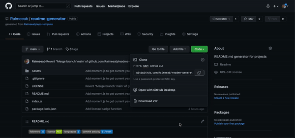
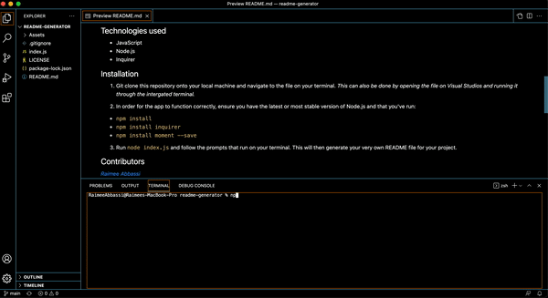
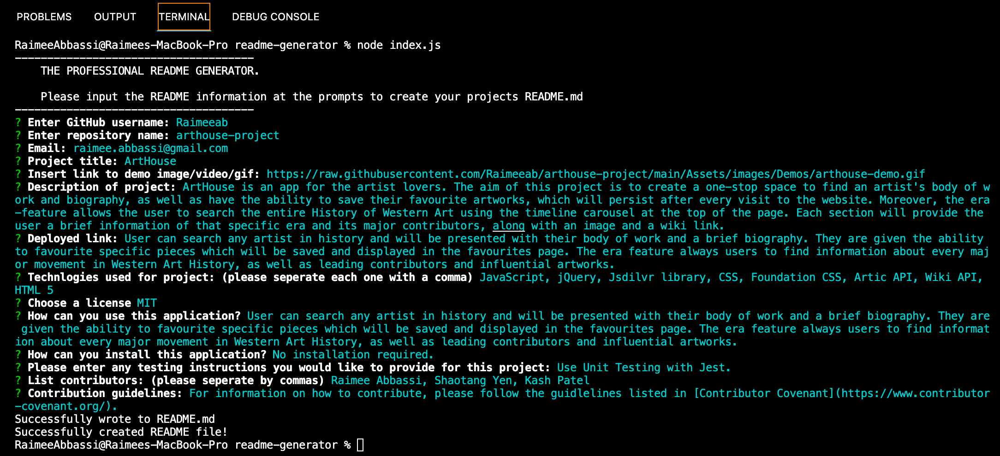

     

# README Generator
---

## 📝 Description
When creating an open source project on GitHub, it’s important to have a high-quality README for the app. This should include what the app is for, how to use the app, how to install it, how to report issues, and how to make contributions.

You can quickly and easily create a README file by using a command-line application to generate one. This allows the project creator to devote more time to working on the project.

## 🕹 Technologies used 

- JavaScript
- Node.js
- Inquirer 
- Moment.js

## ⚙️ Installation 

*You can find a step-by-step tutorial [here](https://github.com/Raimeeab/readme-generator/blob/main/Assets/demos/walkthrough.mov)*
1. Git clone this repository onto your local machine and navigate to the file on your terminal. *This can also be done by opening the file on Visual Studios and running it through the intergated terminal.*

2. In order for the app to function correctly, ensure you have the latest or most stable version of Node.js and that you've run:
    - `npm install`
    - `npm install inquirer`
    - `npm install moment --save` 

3. Run `node index.js` and follow the prompts that run on your terminal. This will then generate your very own README file for your project. 

## 🖥 Usage 
Follow the installation steps to generate your readme in your command-line terminal. 
- If you wish to do multiple READMEs, please keep in mind that the README file will overwrite itself if the project name is the same.
- If you wish to opt out of the prompts midway, simply type `Ctrl+C`.
- Although there is an option to have an unlicensed project, it is highly reccomended to always have some sort of license agreement.

## 👥 Contributors

*[Raimee Abbassi](https://github.com/Raimeeab)*  
*The Univserity of Sydney | Trilogy Education Services*  

## 🔖 License

MIT License
Copyright (c) [2021] [readme-generator] 
Permission is herby granted, free of charge, to any person obtaining a copy of this software and associated documentation files (the "Software"), to deal in the Software without restriction, including without limiation the rights to use, copy, modify, merge, publish, distribute, sublicense, and/or sell copies of the Software, and to permit persons to whom the Software is furnished to do so, subject following coditions: 
The above copyright notice and this permission notice shall be included in all copies or substantial portions of the Software. 

THE SOFTWARE IS PROVIDED "AS IS", WITHOUT WARRANTY OF ANY KIND, EXPRESS OR IMPLIED, INCLUDING BUT NOT LIMITED TO THE WARRANTIES OF MECHANTABILITY, FITNESS FOR A PARTICULAR PURPOSE AND NONINFRINGEMENT. IN NO EVENT SHALL THE AUTHORS OR COPYRIGHT HOLDERS BE LIABLE FOR ANY CLAIM, DAMAGES OR OTHER LIABILITY, WHETHER IN AN ACTION OF CONTRACT, TORT OR OTHERWISE, ARISING FROM, OUT OF OR IN CONNECTION WITH THE SOFTWARE OR THE USE OF OTHER DEALINGS IN THE SOFTWARE.  

---
## 🤝 How to Contribute

For information on how to contribute, please follow the guidlelines listed in [Contributor Covenant](https://www.contributor-covenant.org/).

## ❓ Questions
If you have any questions, contact me via [email](raimee.abbassi@gmail.com). You can also find more of my work [here](https://github.com/Raimeeab).